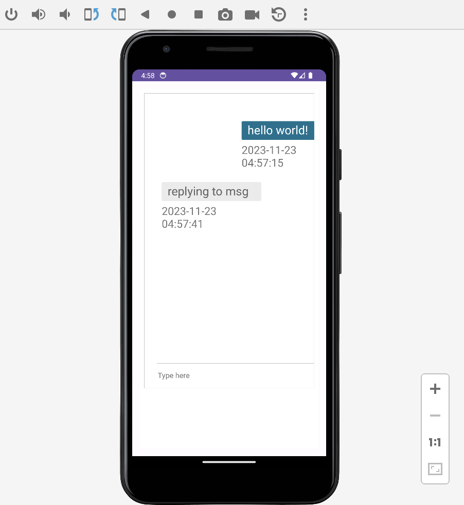

# nabu-chat

Simple android chat using Nabu primitives

Compatible with [nabu-chat](https://github.com/Peergos/nabu-chat)

## Screenshot




## Instructions

Built using [Android Studio](https://developer.android.com/studio)

To build: Build Menu -> Make Project

To run: Run Menu -> Run 'app'


Alternatively from CLI

install gradle

```
gradle build
```

apk file will be built in app/build/outputs/apk
